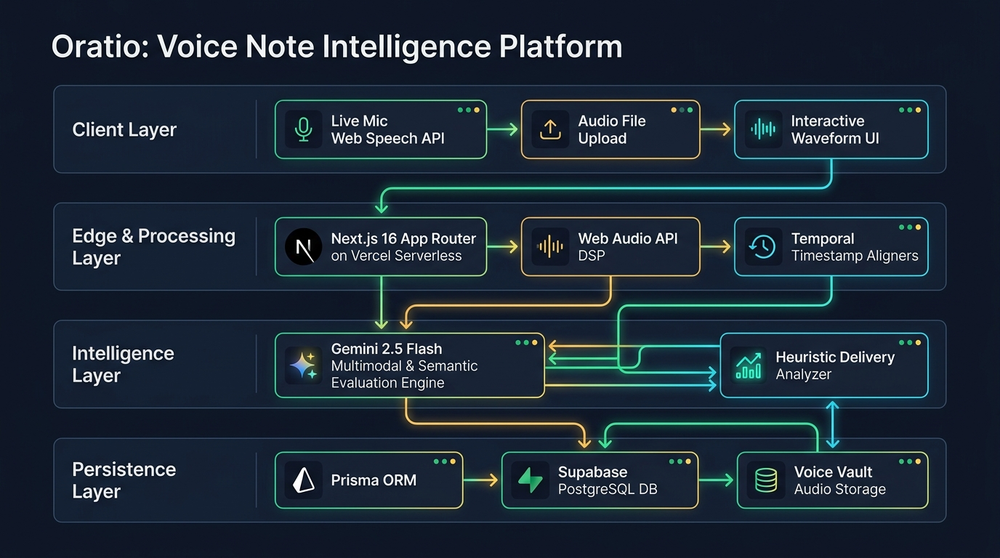

# 🎙️ Oratio: Hackathon Pitch, Demo & Architecture Guide

> **Project**: Oratio — Voice Note Intelligence & Delivery Coach  
> **Presentation Duration**: 3 – 4 Minutes  
> **Tone**: Confident, technical, product-focused, dynamic  

---

## 🖥️ Screen Pre-Setup (Before Walking On Stage)

Pre-open these **3 browser tabs** in full screen (`F11`):

| Tab # | URL / Resource | Purpose |
| :---: | :--- | :--- |
| **Tab 1** | `http://localhost:3000/` (or live Vercel URL) | **Beginning State (0:00 - 0:45)**: Shows live Overview dashboard, hero tagline, and real delivery telemetry. |
| **Tab 2** | `http://localhost:3000/analyze` (or live `/analyze`) | **Live Demo (0:45 - 2:00)**: Studio ready to show "Record Live" mic & "Upload Audio File". |
| **Tab 3** | `public/oratio_architecture.jpg` (or live `/oratio_architecture.jpg`) | **Architecture Walkthrough (2:00 - 2:45)**: 4-layer technical system diagram. |

---

## 🖼️ System Architecture Diagram

*(Also available directly at `/oratio_architecture.jpg` on your live website).*

---

## 📜 Full Spoken Script & Stage Cues

### **Part 1: The Hook & The Problem (0:00 – 0:45)**

**[SCREEN: Tab 1 — Oratio Overview Dashboard (`/`)]**  
*(Let the judges see the live dark-mode dashboard with real stats: Delivery Score 86.5, Baseline Cadence 137.5 WPM, Filler Density 1.2%)*

> *"Judges and fellow builders, think about how often you communicate high-stakes ideas out loud each day.*
> 
> *It’s rarely a 30-minute keynote with prepared slides. It’s a 90-second voice note to your co-founder, an impromptu sprint update in a standup, or a voice message to an investor.*
> 
> *Yet, traditional speech coaching software is built exclusively for scripted presentations. They give you vague scores like '7/10 clarity,' but they can't tell you **when** you lost your train of thought, **why** your cadence spiked at second 42, or **how** your verbal crutches compound over time.*
> 
> *Introducing **Oratio**: Personal Voice Note Intelligence and Delivery Coaching."*

---

### **Part 2: The Live Demo (0:45 – 2:00)**

**[ACTION: Switch to Tab 2 — Analyze Studio (`/analyze`)]**

> *"Oratio meets speakers where they actually work, offering two streamlined intake paths:*
> 1. *First: **Record Live** with our real-time Web Speech recognizer and dynamic visualizer.*
> 2. *Second: **Upload Audio File**, allowing you to drop in any `.mp3`, `.wav`, or `.m4a` voice note from Telegram, WhatsApp, or voice memos.*
> 
> *Let's run an analysis on a recent standup update."*

**[ACTION: Click Analyze or click open a speech from the Voice Vault (`/speeches`)]**

> *"Here is where Oratio departs from basic transcription tools. We don't just dump text; we correlate acoustic cadence with semantic intent.*
> 
> *Notice our delivery indicators:*
> - *Our **Cadence Gauge** shows a baseline of 152 WPM, highlighting a nervous acceleration past 175 WPM.*
> - *Our **Filler Density Analyzer** tracks conversational crutches (`um`, `like`, `you know`).*
> - *And most importantly: **Temporal Flaw Grounding**. Click on any highlighted flaw—like this dead-air stall at 0:28 or this pace spike at 0:41—and Oratio jumps to that exact moment with pinpoint actionable feedback."*

**[ACTION: Briefly open the AI Coach tab (`/ai-coach`)]**

> *"Finally, we have the **AI Coach**. Instead of generic advice, Oratio pulls context directly from your historical voice vault. You can ask:*
> 
> > *'How can I sound more authoritative when explaining trade-offs?'*
> 
> *And the coach responds with drills formulated specifically around your personal cadence weaknesses."*

---

### **Part 3: Architecture Deep Dive (2:00 – 2:45)**

**[ACTION: Switch to Tab 3 — Architecture Diagram (`/oratio_architecture.jpg`)]**

> *"Here is how Oratio works under the hood across four distinct layers:*
> 
> 1. **Client Layer**:
>    - Built with **Next.js 16 App Router** and styled with a custom, frameless dark-mode design system.
>    - Uses the browser's native **Web Audio API** and **Web Speech API** for zero-latency live mic capture and interactive waveform rendering.
> 
> 2. **Edge & Processing Layer**:
>    - Runs on **Vercel Serverless Functions**.
>    - Audio signals pass through our DSP audio processing module to compute silence ratios, pause duration distributions, and millisecond timestamp alignment.
> 
> 3. **Intelligence Layer (Hybrid AI Architecture)**:
>    - **Gemini 2.5 Flash**: Evaluates structural outlines, executive summaries, and multi-factor rubric scores (Delivery, Clarity, Structure, Fluency).
>    - **Deterministic Heuristic Engine**: Guarantees zero downtime. Even under API rate limits or offline conditions, local acoustic heuristics instantly score cadence, pauses, and filler density.
> 
> 4. **Persistence Layer**:
>    - Powered by **Prisma ORM** connected to a managed **Supabase PostgreSQL** database.
>    - Stores audio records, timestamped flaw events, and personal baseline benchmarks for long-term progress tracking."*

---

### **Part 4: Conclusion & Closing Vision (2:45 – 3:15)**

**[ACTION: Switch back to Tab 1 — Oratio Overview Dashboard]**

> *"Spoken clarity is the highest-leverage skill in the modern AI era. While AI can write your text, your voice is how you lead, negotiate, and inspire.*
> 
> *Oratio turns every informal voice memo into deliberate speaking practice—measurable, timestamped, and private.*
> 
> *Thank you! We're ready for your questions."*

---

## 🛡️ Judge Q&A Defense Guide

| Likely Question | Recommended Winning Answer |
| :--- | :--- |
| **"Why not just use Whisper + ChatGPT?"** | *"Whisper gives you raw words, but completely strips out delivery acoustics—like dead air pauses, tempo spikes, and hesitation patterns. Oratio combines acoustic DSP signal processing with LLM semantic reasoning to ground feedback on exact timestamps."* |
| **"What happens if Gemini is slow or the API key fails?"** | *"We built an automatic fallback pipeline. If the LLM is unreachable, our deterministic heuristics immediately take over, calculating WPM, fillers, and rubric scores with zero latency."* |
| **"How is this different from tools like Yoodli or Poised?"** | *"Those are heavy desktop apps designed for scheduled Zoom calls with intrusive screen overlays. Oratio is frictionless and web-native—optimized specifically for voice notes, audio memos, and asynchronous team communication."* |
| **"Is speaker data secure and private?"** | *"Yes. Audio files are isolated in the user's personal vault on Supabase, and we do not use user speech data to train external foundational models."* |

---

## ⚡ Quick 30-Second Elevator Pitch

> *"Oratio is an intelligent speech delivery coach built specifically for voice notes and async speaking. We turn messy voice memos into high-precision delivery telemetry—analyzing cadence spikes, filler clusters, and awkward pauses grounded to exact timestamps. Powered by Next.js 16, Gemini 2.5 Flash, Prisma, and Supabase."*
